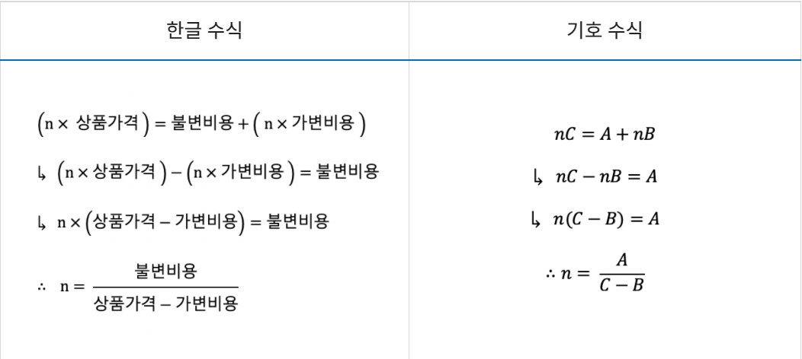
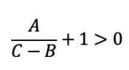
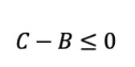

# 손익분기점_1712

시간이 짧고 입력값이 크기 때문에 단순히  반복문으로 접근하면 시간초과로 문제를
풀지 못한다. 다르게 접근해야 한다.

- n x 상품 가격(C) > 고정비용(A) + (n * 가변비용(B))을 만족하는 n 찾는 문제
- 손익분기점을 수식으로 정리하면 다음과 같다.
- (n x 상품가격) = 불변비용 + (n x 가변비용)

공식을 단순화하면 다음과 같다.


여기서 n(판매갯수)은 손익분기점이다. 즉 판매 갯수가 n일때 수익과 손해가 같아지는 지점이다.
문제는 수익이 날 때의 판매 갯수를 찾는 것이므로 이 식에 +1을 더해준다.

즉 다음 식이 이익이 발생하는 판매량의 갯수다.


그리고 보니 마지막에 다른 조건이 있었다.
`이익이 발생하지 지점이 없다면 -1을 출력한다.`

이 말을 위의 수식과 연관지어 생각해보자. 위의 수식은 '이익이 발생하는 지점'을 수식화 한 것이다.
그렇다면 저 수식의 반대가 `이익이 발생하지 않는  경우`가 아닐까?
그리고 a는 자연수이고 불변의 값이면  c-b가 음수일때 만이 유일한 `이익이 발생하지 않는 경우` 아닐까?
또한 c-b가 0일때도 양의 무한대 또는 음의 무한대로 가기때문에 손익분기점이 나올 수 없게된다.

따라서 이익이 발생하지 않는 경우를 수식으로 표기하자면 다음과 같다.



## 소스코드
```java
import java.util.Scanner;

public class 손익분기점_1712_2 {
 public static void main(String[] args) {
  Scanner in = new Scanner(System.in);
  int A = in.nextInt();
  int B = in.nextInt();
  int C = in.nextInt();

  if( C<= B) {
   System.out.println("-1");
  }
  else{
   System.out.println((A/(C-B))+1);
  }
 }
}

```